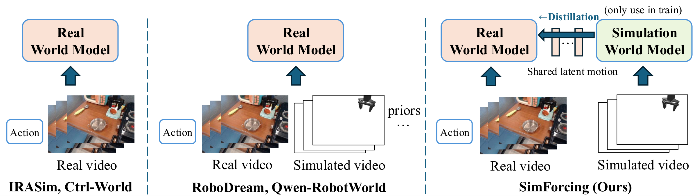
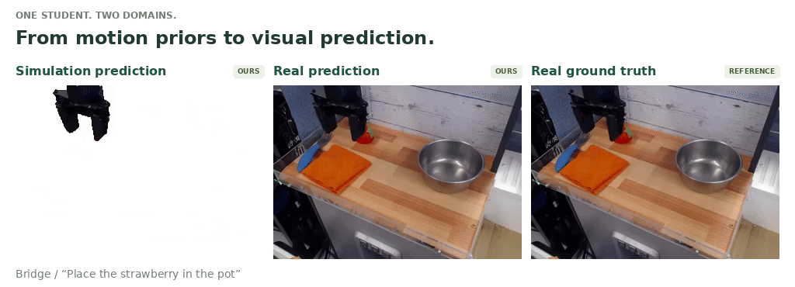
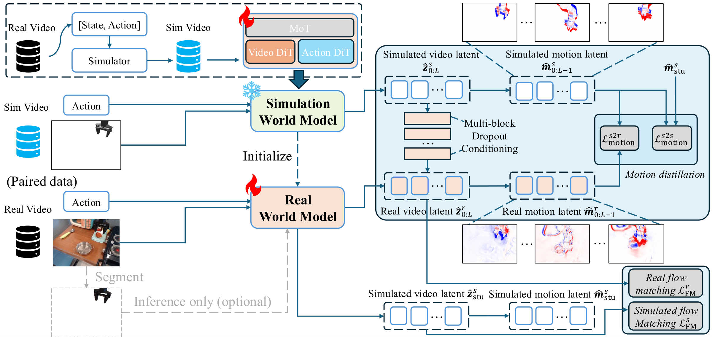

# SimForcing: Distilling Simulation Motion Priors into Real-Domain Robot World Models

<p align="center">
<a href="https://wang-xiaodong1899.github.io/assets/SimForcing.pdf"></a>
<a href="https://wang-xiaodong1899.github.io/SimForcing/"></a>
</p>

**TL;DR:** SimForcing learns motion priors from a simulation world model and transfers them to real-domain robot video prediction through latent-motion distillation and optional simulation conditioning.

## Teaser

<p align="center">
  
  <br>
  <em>Figure 1. Comparison of training paradigms for action-conditioned robot world models.</em>
</p>

## From motion priors to visual prediction

<p align="center">
  
</p>

## Method Overview

<p align="center">
  
  <br>
  <em>Figure 2. SimForcing's two-stage training: simulation world model learning followed by sim-to-real distillation.</em>
</p>


## Installation

Use Python 3.10 or newer. Install a matching CUDA-enabled PyTorch/torchvision pair for your machine, then install from this repository root:

```bash
pip install -e '.[train]'
```

The `train` extra supplies DeepSpeed and optional W&B logging. TFDS metadata preparation additionally requires `pip install -e '.[prepare]'`. Training the full 5B model requires suitable GPU memory; the CPU tests below use tiny models and do not measure full-model memory requirements.

## Weights and paths

Place the pretrained Wan files in this layout, or set the environment variables below:

```text
checkpoints/
  Wan2.2-TI2V-5B/
    diffusion_pytorch_model*.safetensors
    models_t5_umt5-xxl-enc-bf16.pth
    Wan2.2_VAE.pth
  Wan2.1-T2V-1.3B/google/umt5-xxl/   # Tokenizer files
  action_dit.pt
  sim_teacher.pt                  # Optional copy of a stage-1 checkpoint
```

| Variable | Default | Purpose |
| --- | --- | --- |
| `WAN_MODEL_DIR` | `./checkpoints/Wan2.2-TI2V-5B` | Wan DiT, text encoder and VAE |
| `WAN_TOKENIZER_DIR` | `./checkpoints/Wan2.1-T2V-1.3B` | Repository containing `google/umt5-xxl/` |
| `ACTION_DIT_CHECKPOINT` | `./checkpoints/action_dit.pt` | ActionDiT backbone initialization |
| `SIM_TEACHER_CHECKPOINT` | `./checkpoints/sim_teacher.pt` | Stage-1 checkpoint for both the frozen teacher and student initialization |
| `BRIDGE_TRAIN_DIR` | `./data/bridge_train` | Training metadata and action caches |
| `BRIDGE_VAL_DIR` | `./data/bridge_val` | Baseline held-out validation data |
| `BRIDGE_TEXT_CACHE` | `./data/text_embeds/bridge_train` | Training text embeddings |
| `BRIDGE_VAL_TEXT_CACHE` | `./data/text_embeds/bridge_val` | Baseline validation text embeddings |

The default loader reads the original Wan `.pth` files. To use converted safetensors, set `WAN_CONVERTED_DIR` to their directory and override `model.redirect_common_files=true`.

Prepare the ActionDiT backbone once:

```bash
python scripts/preprocess_action_dit_backbone.py \
  --model-config configs/model/action_conditioned.yaml \
  --output checkpoints/action_dit.pt
```

Stage 1 produces a simulation-trained action-conditioned checkpoint with a top-level `mot` state dictionary containing both `mixtures.video.*` and `mixtures.action.*`. Stage 2 uses this same checkpoint for the frozen simulation teacher (`model.frozen_video_expert_checkpoint`) and student initialization (`resume`). Set `SIM_TEACHER_CHECKPOINT` to the stage-1 model-only `.pt` file; `resume=${model.frozen_video_expert_checkpoint}` keeps the two paths synchronized. Pretrained Wan weights and datasets are not included.

## Bridge data

The data loader expects `meta/episodes.jsonl`, `meta/tasks.jsonl`, and per-episode action/proprioception caches. Each video frame must contain a horizontal concatenation `[simulation | real]`. Stage 1 reads the left simulation half, the real-data baseline reads the right half, and stage-2 SimForcing reads both halves with the same actions and sample window. Actions have seven dimensions: translation (3), axis-angle rotation (3), and gripper (1); proprioception also has seven dimensions.

Prepare metadata for aligned TFDS trajectories and videos:

```bash
python scripts/prepare_bridge_v2_meta.py \
  --bridge-tfds-path /path/to/bridge/0.1.0 \
  --video-root /path/to/paired/training/videos \
  --out-dir ./data/bridge_train --split 'train[:2000]'

python scripts/prepare_bridge_v2_meta.py \
  --bridge-tfds-path /path/to/bridge/0.1.0 \
  --video-root /path/to/paired/validation/videos \
  --out-dir ./data/bridge_val --split test
```

The validation command uses the TFDS `test` split. Validation videos must correspond to that split in the same trajectory order. Video names must be `0.mp4`, `1.mp4`, etc., indexed from zero within the selected TFDS split. This script prepares metadata and action caches; simulation rendering and video generation are outside this repository. Existing metadata can be reused; set `data.train.video_root=/path/to/videos` if recorded video paths need relocating.

Precompute all neutral, simulation and real prompt embeddings before training:

```bash
python scripts/precompute_text_embeds.py task=bridge_act_cond_224_1e-4
python scripts/precompute_text_embeds.py task=bridge_real_act_cond_224_1e-4
python scripts/precompute_text_embeds.py task=bridge_real_simforcing_224_1e-4
```

All three recipes use 21 frames, 224×320 crops and synchronized action/video steps.

## Training

Run commands from the repository root. The default batch size is 16 per process; adjust it to available memory.

### Stage 1: simulation world model

Train the action-conditioned model on simulation frames with `configs/task/bridge_act_cond_224_1e-4.yaml`:

```bash
accelerate launch --config_file scripts/accelerate_configs/accelerate_zero2_ds.yaml \
  --num_processes 8 scripts/train.py \
  task=bridge_act_cond_224_1e-4 output_dir=./runs/simulation
```

### Stage 2: SimForcing

After stage 1 finishes, select its model-only `.pt` checkpoint. Replace the example filename below with the checkpoint you want to use:

```bash
export SIM_TEACHER_CHECKPOINT=./runs/simulation/checkpoints/weights/step_008000.pt

accelerate launch --config_file scripts/accelerate_configs/accelerate_zero2_ds.yaml \
  --num_processes 8 scripts/train.py \
  task=bridge_real_simforcing_224_1e-4 output_dir=./runs/simforcing
```

The configuration connects the two roles to the same file:

```yaml
model:
  frozen_video_expert_checkpoint: ${oc.env:SIM_TEACHER_CHECKPOINT,./checkpoints/sim_teacher.pt}
resume: ${model.frozen_video_expert_checkpoint}
```

`model.frozen_video_expert_checkpoint` loads the simulation teacher, whose parameters remain frozen. `resume` initializes the trainable SimForcing student from the same simulation world model weights. Stage 2 starts a new optimizer and schedule when given this `.pt` file. You can also set `model.frozen_video_expert_checkpoint=/path/to/stage1.pt` on the training command; `resume` follows it automatically. Use a model-only file for this transition, not a stage-1 training-state directory.

### Real-data baseline

The baseline trains directly on real frames as a separate comparison:

```bash
accelerate launch --config_file scripts/accelerate_configs/accelerate_zero2_ds.yaml \
  --num_processes 8 scripts/train.py \
  task=bridge_real_act_cond_224_1e-4 output_dir=./runs/baseline
```

## Inference

Use model-only `.pt` checkpoints and the normalization statistics from the same training run:

```bash
python scripts/infer.py --task bridge_real_act_cond_224_1e-4 \
  --checkpoint runs/baseline/checkpoints/weights/step_004000.pt \
  --norm-stats runs/baseline/dataset_stats.json --output outputs/baseline.mp4

python scripts/infer.py --task bridge_real_simforcing_224_1e-4 \
  --checkpoint runs/simforcing/checkpoints/weights/step_004000.pt \
  --norm-stats runs/simforcing/dataset_stats.json \
  --sim-cfg 0.6 --output outputs/simforcing.mp4
```

SimForcing inference first predicts simulation latents from the simulation first frame and actions, then uses those predicted latents to generate real video. It does not feed ground-truth future simulation frames. `--sim-cfg` controls reliance on the simulation condition (`0` disables its contribution, `1` uses the conditioned prediction). The frozen teacher is omitted at inference. Inputs still require the paired first frames and action trajectory.

The Python API exposes `SimForcing.infer_sim_latents()` and `SimForcing.infer_video()` for externally supplied simulation latents/videos. Model-only checkpoints store weights under `mot` and `proprio_encoder`.

## Citation

If you find SimForcing useful in your research, please cite:

```bibtex
@article{wangsimforcing,
  title={{SimForcing}: Distilling Simulation Motion Priors into Real-Domain Robot World Models},
  author={Wang, Xiaodong and Li, Tianle and Song, Chuanxin and Xie, Junliang and Zhong, Zhanmi and Wu, Suiying and Peng, Peixi}
}
```

## Attribution and license

This code is derived from [FastWAM](https://github.com/yuantianyuan01/FastWAM); its MIT copyright notice is retained in `LICENSE`. The Wan components build on Wan2.2 and the DiffSynth implementation used by the source project. The Wan Apache-2.0 license is included under `licenses/`. Pretrained weights and datasets remain subject to their respective upstream terms.
